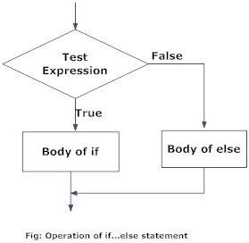

```{r setup, include=FALSE}
knitr::opts_chunk$set(echo = TRUE, comment=NA)
```


## `if` statement {.t}
```r
if(condition) {
  # do something 
}
```
```{r, out.width = "100px", out.height="120px", echo=FALSE, fig.align='center', fig.cap="https://www.datamentor.io/r-programming/if-else-statement/"}
knitr::include_graphics("../img/r-if-statement.jpg")
```


## `if..else` statement {.t}
```r
if(condition) {
  # do something 
} else {
  # do something 
}
```
```{r, out.width = "100px", out.height="100px", echo=FALSE, fig.align='center', fig.cap="https://www.datamentor.io/r-programming/if-else-statement/"}

```


## `if..else if...else` statement {.t}
```r
if(condition-1) {
  # do something 
} else if(condition-2){
  # do something 
} else if(condition-3) {
  # do something 
} else {
  # do something 
}
```

## `ifelse` function {.t}
- Vectors form the basic building block of R programming. 
- Most of the functions in R take vector as input and output resultant vector. 
- This vectorization of code, will be much faster than applying the same function to each element of the vector indivodually. 
- Similar concept, there is a vector equivalent form of the `if...else` statement in R, the `ifelse()` function. 

```r
ifelse(condition, x, y)
```


## `for` loop {.t}
```r
for (val in sequence){
  # do something 
}
```
```{r, out.width = "100px", out.height="120px", echo=FALSE, fig.align='center', fig.cap="https://www.datamentor.io/r-programming/if-else-statement/"}
knitr::include_graphics("../img/r-for-loop.jpg")
```


## `while` loop {.t}
```r
while(condition){
  # do something 
}
```
```{r, out.width = "100px", out.height="120px", echo=FALSE, fig.align='center', fig.cap="https://www.datamentor.io/r-programming/if-else-statement/"}
knitr::include_graphics("../img/r-while-loop.jpg")
```


## `break` statement{.t}
```r
if(condition){
  break 
}
```
```{r, out.width = "100px", out.height="120px", echo=FALSE, fig.align='center', fig.cap="https://www.datamentor.io/r-programming/if-else-statement/"}
knitr::include_graphics("../img/r-break-flowchart.jpg")
```

## `next` statement{.t}
```r
if(condition){
  next  
}
```
```{r, out.width = "100px", out.height="120px", echo=FALSE, fig.align='center', fig.cap="https://www.datamentor.io/r-programming/if-else-statement/"}
knitr::include_graphics("../img/r-next-flowchart.png")
```


## `repeat` loop{.t}
```r
repeat {
  # do something 
}
```
```{r, out.width = "100px", out.height="120px", echo=FALSE, fig.align='center', fig.cap="https://www.datamentor.io/r-programming/if-else-statement/"}
knitr::include_graphics("../img/r-repeat-loop.jpg")
```


