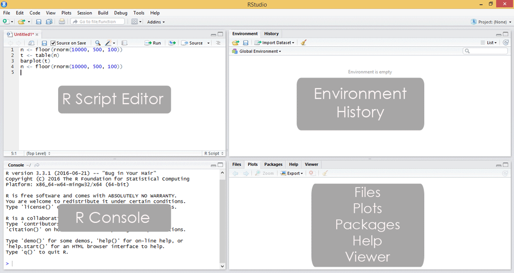

# Section-2: Getting Started
## Installing R {.t}
- Installing R on Windows -
https://cran.r-project.org/bin/windows/base/
- Installing R on Linux -
https://cran.r-project.org/bin/linux/ubuntu/README.html
- Installing R on Mac - 
https://cran.r-project.org/bin/macosx/

## Installing RStudio{.t}
- RStudio is an Integrated Development Environment(IDE) available for R that is built by RStudio. 
- Download and Install
https://rstudio.com/products/rstudio/download/#download

## The RStudio Interface{.t}

